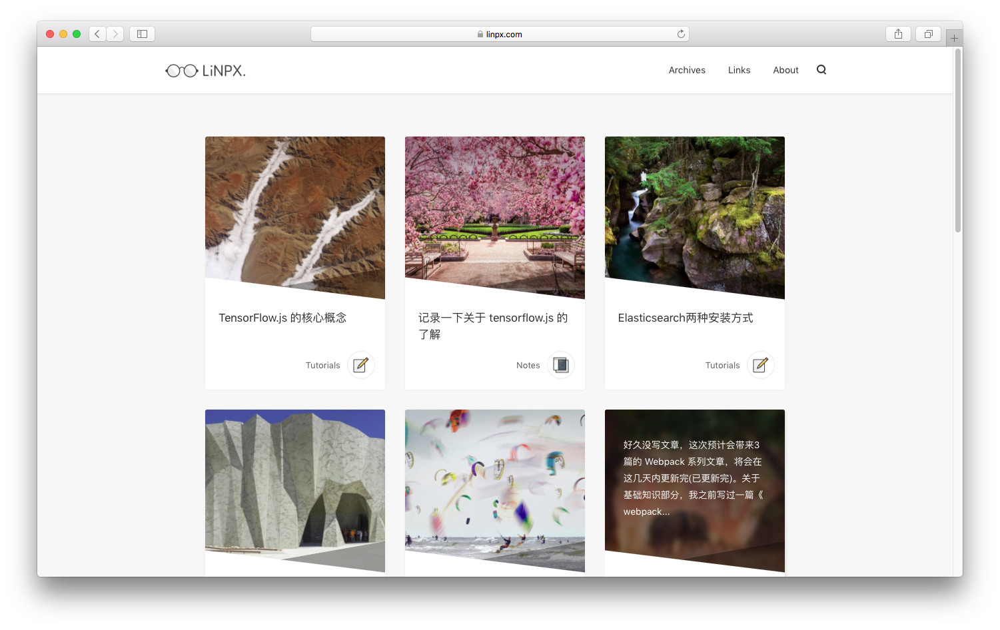
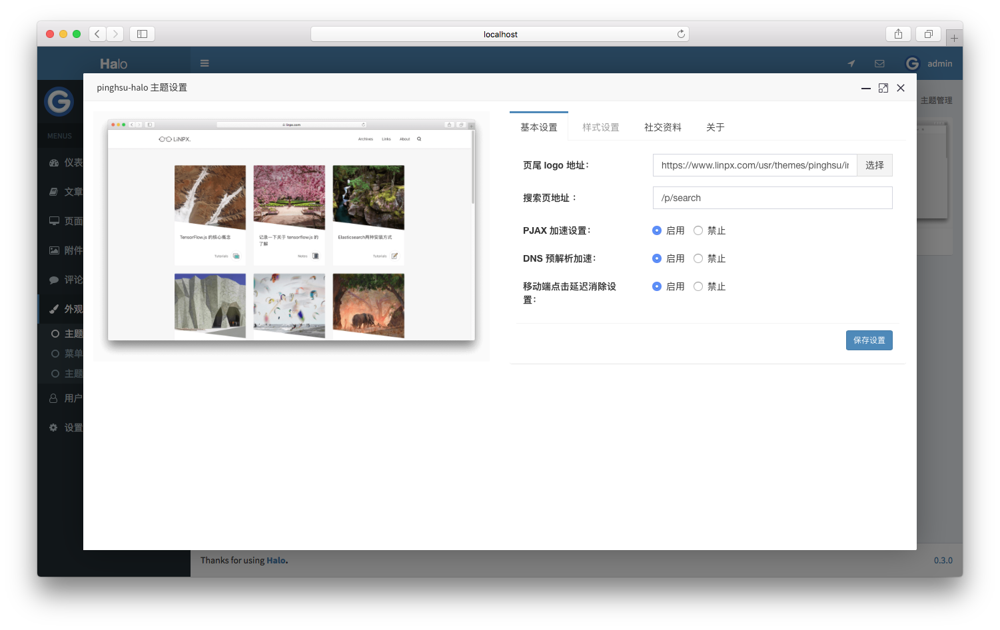

<h1><a href="#" target="_blank">Pinghsu-Halo</a></h1>

> 一款Halo的主题，来自Typecho。

## 说明

该主题的原作者为[Chakhsu.Lau](https://www.linpx.com)，非常感谢做出这么优秀的主题。

原主题地址：[https://github.com/chakhsu/pinghsu](https://github.com/chakhsu/pinghsu)

## 预览截图

## 预览地址

[LiNPX](https://www.linpx.com/)

## 注意

- Halo 版本最低需要为0.4.0

## 使用方法

1. 克隆或者[下载](https://github.com/ruibaby/pinghsu-halo/releases)。
2. 压缩为zip压缩包之后在后台的主题设置直接上传即可使用。

